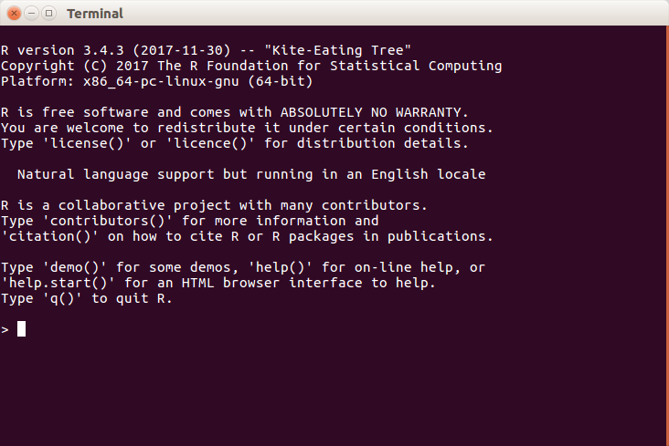

# Introducción

Primero lo primero. 

## ¿Qué es R? 

Es un lenguaje muy versátil, siempre gratuito y de código abierto que permite que análisis estadísticos, visualizaciones, programación y procesos iterativos convivan en un mismo ecosistema. 

## ¿Por qué debo aprender R?

- Porque permite que organizaciones tan relevantes y necesarias como *Mexicanos contra la corrupción y la impunidad* no dependendan de softwares o servicios costosos para mantener su producción de análisis rigurosos. Además, R permite perseguir valores fundacionales de organizaciones de este tipo como la honestidad y la transparencia al permitir un medio relativamente accesible, útil, reproducible y replicable. Además, R permite la recolección, manipulación y comunicación de grandes cantidades de información en poco tiempo y con una curva de aprendizaje relativamente corta.

## ¿Cómo puedo aprender R?
- Cursos como este sirven para dar una introducción a las posiblidades de R. Por lo tanto, el objetivo de este curso no es tanto el de volver a las personas que asisten el verbo en carne viva de R, sino que su objetivo principal es que **pierdan el miedo a experimentar y sepan hacer las preguntas correctas**. Esto no es por desidia o flojera de quien diseña el curso, sino porque hay tantos caminos en R para resolver problemas como preguntas por hacer y mil sesiones de 24 horas no terminarían de cubrir todas las posiblidades.

## ¿Cómo uso R?

### Descargar e instalar R del CRAN

1. Primero hay que instalar R desde la página del CRAN (*The Comprehensive R Archive Network*) que conjunta "espejos" de todo el planeta para asegurar la disponibilidad y buen funcionamiento de R sin importar la hora del día o las circunstancias. Pueden encontrar ese maravilloso santuario en esta paǵina: [`https://cran.r-project.org/mirrors.html`](https://cran.r-project.org/mirrors.html). 

2. Sin embargo, entiendo que nadie puede negar la cruz de su parroquia y que las personas que asisten a este curso tiene una marca indeleble, así que les recomiento usar el siguiente espejo para descargar su copia de R: [`https://cran.itam.mx/`](https://cran.itam.mx/). Siéntanse orgullosxs.

3. Luego de entrar al "espejo", elijan su sistema operativo, descarguen el instalador e instalen el programa de la versión **3.4.3**. En el caso de MS Windows o Linux, existe una opción de *install R for the first time*. Esa es la buena. Si no, busquen la versión antes mencionada.

4. Déjense inundar por el absoluto vacío de la consola de R que se ve más o menos como la figura 1 (en Ubunto 16.04 LTS).
 

{ width=50% }

Pero la vida no tiene que ser tan estéril...


### Descargar e instalar RStudio 

RStudio es la cosa más maravillosa para usar R. Se trata de un *ambiente de desarrollo integrado* que básicamente permite organizar y visualizar todo lo que hacemos con R. Vamos, lo hace más *humano* y más accesible a los usuarios que aprendimos usando *MS Office* o *STATA*.

1. Para instalarlo basta con ir a la siguiente página web: [`https://www.rstudio.com/products/rstudio/download/`](https://www.rstudio.com/products/rstudio/download/)
2. Descargar el que mejor nos acomode.
3. Instalar.

## ¿Cómo puedo pedir ayuda?

1. **Pedir ayuda a R**: Basta con escribir en R el símbolo `?` seguido de aquello que les produzca curiosidad. Por ejemplo:

```{r}
?summary()
?sum()
?plot()
```


Este comando hará que una pequeña pantalla aparezca en la esquina inferior derecha de RStudio explicando la descripción del paquete, su uso (sintaxis), los argumentos que se pueden incluir o modificar, detalles, sugerencias y la parte más importante **LOS EJEMPLOS**.


2. **Google**: No es broma ni pretende ofenderles. Cualquier persona, por más experta que sea, pregunta cosas en google como "*[How do I merge two datasets in R?](https://www.statmethods.net/management/merging.html)*", "*[How do I import a `.xls` file in R](https://www.r-bloggers.com/read-excel-files-from-r/)*", o incluso "*[How do I built a convolutional neural network in R for images recognition?](https://www.r-bloggers.com/image-recognition-tutorial-in-r-using-deep-convolutional-neural-networks-mxnet-package/)*". Puse las preguntas en inglés porque, tristemente, es más fácil encontrar información en este diioma. Fuera de eso, todo está al alacance de sus manos. Sólo hay que buscar y, esto es sin ningún afán de ofender, es muy poco probable que su progunta no haya sido resuelta, al menos en este momento de su vida en R. 

3. Los resultados del punto anterior les darán un sinfín de resultados. Sin embargo, hay cuatro fuentes particularmente útiles en R:

- *Quick R* - https://www.statmethods.net/

- *Stack Overflow* - https://stackoverflow.com/

- *Stack Exchange* - https://stackexchange.com/

- *R-Bloggers* - https://www.r-bloggers.com/

- *Revolution Analytics* - http://blog.revolutionanalytics.com/

La idea es que vean cómo resulve la gente sus preguntas y copien esos códigos para adaptarlos a su propio trabajo.


# Sintaxis de R

La sintaxis de R es bastante simple y puede verse como un lenguaje natural (como el alemán o el español). Así como los lenguajes humanos, los lenguajes computacionales difieren en sus sintaxis. 

Por ejemplo, el lenguaje de *Stata* está basado en el verbo. En *Stata*, el verbo (el comando, vaya) en la instrucción `reg mpg disp` define la acción del programa, puesto que `reg` es la partícula fundamental que actúa en las *mpg* y *disp* y que tiene como opciones todo lo que va después de la coma. Este comando, literalmente, le está diciendo a *Stata* algo como: "regresiona las variables 1 y 2".

En R, en cambio, el énfasis está en **el sujeto**. Es decir, en R definimos **objetos** que contienen un tipo particular de datos o el resultado de una función. Definir un objeto en R es muy sencillo, basta con escribir el signo de igual (`=`) o la popular "flechita" (`<-`) después de cualquier palabra que queramos convertir en objeto. En este curso vamos a usar la flecha negra porque somos puristas y porque usarla evitará ambigüedad en más de una ocasión.

Así, el mismo comando que presentamos en *Stata* se escribiría en R de la siguiente manera:

```{r, echo=FALSE, message=FALSE}
require(stats)
library(pander)
library(knitr)
library(xkcd)
mtcars <-  mtcars 
```

```{r}
modelo1 <- lm(mpg ~ disp, data = mtcars)
```

El comando literalmente le está diciendo a R: "Crea un objeto que se llame "modelo1" que va a contener la información de una regresión lineal (`lm` significa "*linear model*") entre la variable `mpg` y `disp`. 

Con base en el `modelo1` podemos definir, por medio de la función `summary()`, un objeto que nos permita manipular los resultados específicos de la regresión.

```{r}
s.modelo1 <-summary(modelo1)
s.modelo1
```

Otra ventaja es que podemos utilizar la información de este objeto para muchas cosas, sin tener que definirlo de nuevo. Por ejemplo, es posible hacer una elegante tabla con el paquete (ahora entraremos en eso) `pander`.

```{r}

pander(modelo1)

```

## Bueno, ¿y no es más fácil simplemente poner comandos que andar definiendo objetos?

Ciertamente. Pero los análisis que permite el uso de objetos dan una flexibilidad increíble y permite que nos ahorremos muchísimo tiempo después al realizar y organizar nuestros resultados. No es lo mismo reproducir un Do-file con todos nuestros procedimientos a aplicar fórmulas a objetos predefinidos. En términos prácticos, mientras que en *Stata* sólo podemos utilizar los resultados de nuestra última regresión para usar el comando `predict`, en R basta que usemos el modelo que definimos antes. La función `kable` crea una bonita tabla para los valores predichos.

Para hacer todo esto usamos sólo dos líneas más.

```{r}
yhat <- predict(modelo1)
kable(yhat)
```


# Markdown uso y sintaxis

Antes de seguir con el emocionante mundo de R, es importante concoer la forma de comunicarnos con R y las personas. Este documento lo están leyendo en .pdf, pero en realidad fue escrito en un lenguaje llamado *Markdown*- Iremos aprendiendo poco a poco a usarlo. Por lo mientras, es momento de que abran el archivo con terminación .Rmd (R markdown). Este archivo se abrirá en automático en su RStudio. 

- La cheatsheet de Markdown (https://github.com/adam-p/markdown-here/wiki/Markdown-Cheatsheet) será su guía para escribir documentos en este lenguaje.

Por lo pronto, lo importante es que ven estos cuadro grises que reciben el nombre de "chunks" y se abren escribiendo "```{r}" y se cierran con "```". Dentro de estos recuadros, podrán ir los comandos que necesiten y serán activados con las pequeñas flechas verdes que aparecerán si el chunk está correctamente definido. Prueben por ustedes mismos:

T```{r, message=FALSE, eval=FALSE}
install.packages("rgl") # En un ratito les digo que significa esto.
```

```{r, eval=FALSE}
demo(lollipop3d, package="rgl") # Esto activa un demo
```

# Ahora sí, manos a la obra

## Instalar un paquete

La mayoría de las herramientas de R se encuentran contenidas en una serie de paquetes que pueden instalarse escribiendo los siguiente:

```{r, eval=FALSE}
install.packages("el_nombre_del_paquete")
```

Vamos a instalar, por ejemplo, la poderosa paquetería `tidyverse`que, a su vez, tiene otros paquetes increíbles como `ggplot2` y `dplyr` para visualizar y manipular datos, respectivamente. Esto sólo se tiene que hacer una vez.

```{r, eval=FALSE, message=FALSE}
install.packages("tidyverse")
install.packages("yarrr")
```

## Llamar a un paquete

**Todos** los paquetes que usemos necesitan ser llamados previamente, ya sea en nuestro documento .Rmd o en la consola. RStudio precarga los básicos `statistics`, `graphics`, `MASS` y `foreign`, pero estos paquetes cada vez se utilizan menos y sirven como una mera introducción a R. Lo usaremos porque hay muchos que son muy prácticos y útiles para la vida profesional.

Intentemos algo básico. En el paquete `Yarrr` hay una gráfica muy buena que grafica un boxplot y envuelve en un polígono los outliers. Intentémos hacer una:

```{r, eval=FALSE}
pirateplot(formula = weight ~ Time, 
           data = ChickWeight,
           pal = "xmen")
```

R se queja y nos dice: `could not find function "pirateplot"`. Esto se debe a que no hemos llamado al paquete que recientemente instalamos.

```{r, message=FALSE, warning=FALSE}
library(yarrr)

pirateplot(formula = weight ~ Time, 
           data = ChickWeight,
           pal = "xmen")
```

Lo que le estamos diciendo a R es que vamos a utilizar la sintaxis y las funciones de la paquetería `Yarrr`. Dentro de esta sintaxis se encuentra la función `pirateplot()` que crea una boxplot como la describimos antes. Literalmente, le estamos diciendo a R que nos haga una "gráfica pirata" del peso de pollitos en el tiempo, usando los datos del peso de los pollitos con la paleta de colores de los "X-men". (Verán que Phillips es un loquilo). Tan sólo vean sus paletas:

```{r}
piratepal(palette="all")
```

# Tipos de datos

En R existen una serie de tipos de datos que nos permiten hacer diferentes tipos de cosas. (Les recomiendo dar se una vuelta por el extraordinario curso de Jonathan Cornelissen en DataCamp https://www.datacamp.com/courses/free-introduction-to-r).

1. **Vectores:** Un arreglo unidimensional de datos. EStos pueden ser numericos, de caractreres o logicos.

```{r}
a <- c(1,2,5.3,6,-2,4) # numerico
b <- c("one","two","three") # caracter
c <- c(TRUE,TRUE,TRUE,FALSE,TRUE,FALSE) #lógico
```

```{r, echo=FALSE}
library(knitr)
kable(a)
kable(b)
kable(c)

```

Se puede llamar a cialquier elemento del vector de este forma:

```{r}
a[c(1)] # El primer elemento.
a[c(2,6)] # Los elementos 2 y 6.
```

**NOTA**: `c(a,b,c)` indica que vamos a iniciar una lista de nuestra petición. Es decir, vamos a usar más de un elemento.

2. **Matrices:** arreglos bidimensionales de datos que pueden contener todo tipo de datos, pero toda la matriz debe contener el mismo tipo.

```{r}
y<-matrix(1:20, nrow=5,ncol=4)
```

```{r}
kable(y)
```


Literalmente le decimos a R que haga una matriz de los número 1 al 20 ordenadas en 5 filas con 4 columnas.


Podemos incluso asignarle nombre a la matriz:

```{r}
cells <- c(1,26,24,68)
rnames <- c("R1", "R2")
cnames <- c("C1", "C2")
mymatrix <- matrix(cells, nrow=2, ncol=2, byrow=TRUE,
  dimnames=list(rnames, cnames)) 
```

```{r}
kable(mymatrix)
```

Contruimos una matriz de 2x2 que agrupa los datos del objeto *cells* y le asigna los nombres R1 y R2 a las filas y los nombres C1 y C2 a las columnas.

3. **Factores:** Son categorías como las conocemos: sexo(heteronormado), rango de edad, raza, tipo de espada, estado, puesto.

```{r}
gender <- c(rep("male",20), rep("female", 30))
gender <- factor(gender) 
summary(gender) 
```

5. **Listas**: Es la estructura más versatil de R, puede tener todo. Las usaremos muy intensivamente porque utilizan muy poco espacio y nos permiten guardar grandes cantidades de datos de todo tipo.

```{r}
my_list <- list(2,3,4,"bruta", "ciega", "sordomuda", TRUE, FALSE)
my_list
```

6. **"Mallas de datos"**: Son el objeto que más vamos a usar. La mayoría de las bases de datos que conocemos se encuentran en este tipo de estructura de datos. 

```{r}
d <- c(1,2,3,4)
e <- c("red", "white", "red", NA)
f <- c(TRUE,TRUE,TRUE,FALSE)
mydata <- data.frame(d,e,f)
names(mydata) <- c("ID","Color","Passed") # variable names 
```

```{r}
kable(mydata)
```

A modo de final, usemos la base de sobrevivientes del Titanic para hacer un data frame y vean como R puede leer datos de casi cualquier extension. 

```{r}
library(readxl)
titanic <- read_excel("~/Documents/MCCI/Curso_R/Sesión 1/titanic.xlsx")
```

```{r}
kable(head(titanic))
```


# Tareas

No es para invertirle mucho tiempo. Así que les propongo dos tareas (al final no las revisaré ni nada, se las sugiero por el mero gusto de aprender).

1. Demandante de tiempo, pero muy efectiva:["Introdution to R"](https://www.datacamp.com/courses/free-introduction-to-r) de Cornelissen en DataCamp.

2. Un juego bastante corto, pero suficiente: ["Try R"](http://tryr.codeschool.com/) de O'Reilly en CodeSchool.

